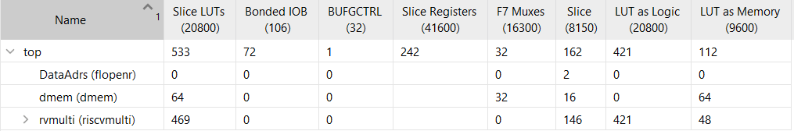

# Results

This document presents the final implementation results of the processor.

## Resource Utilization
The following figure shows FPGA resource utilization after implementation.

## Power Estimation
Estimated power consumption obtained from Vivado power analysis is shown below.

## Summary
The design achieves correct functionality, meets timing constraints, and
demonstrates efficient resource usage for a multicycle RISC-V processor.

