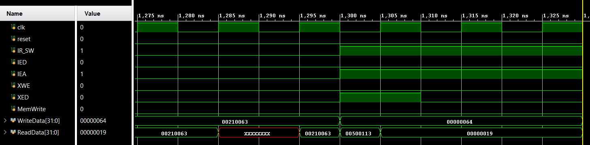
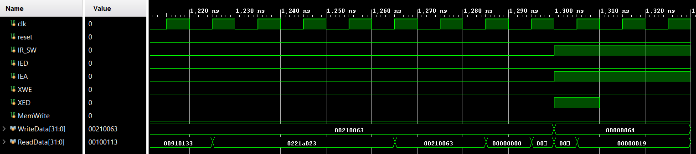
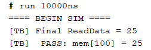
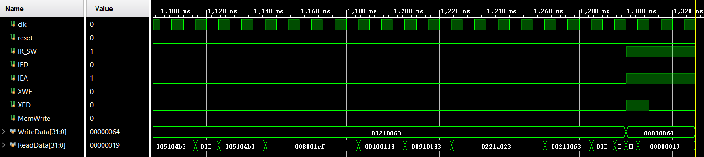

# Simulation and Verification

This document presents the functional and timing verification performed at
different stages of the design flow using Vivado.

## Behavioral (RTL) Simulation
Behavioral simulation was performed to verify correct RTL functionality and
instruction execution before synthesis.

*Tcl Console Output:*

**Result:** PASS

---

## Post-Synthesis Functional Simulation
Functional simulation was performed after synthesis to ensure logical correctness
was preserved through synthesis.

*Tcl Console Output:*

**Result:** PASS

---

## Post-Synthesis Timing Simulation
Timing simulation was performed after synthesis to verify timing behavior with
synthesized delays.

*Tcl Console Output:*

**Result:** PASS

---

## Post-Implementation Functional Simulation
Functional simulation was performed after implementation to verify correctness
with placement and routing effects included.

*Tcl Console Output:*

**Result:** PASS

---

## Post-Implementation Timing Simulation
Post-implementation timing simulation was performed to validate timing closure
under routed delays.

*Tcl Console Output:*

**Result:** PASS

